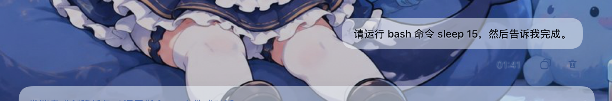
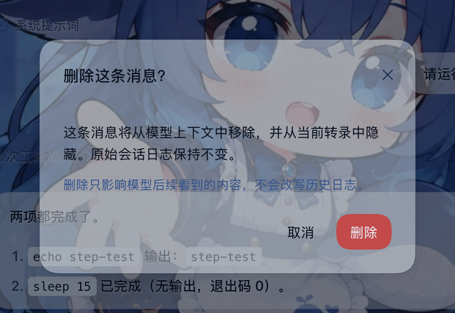
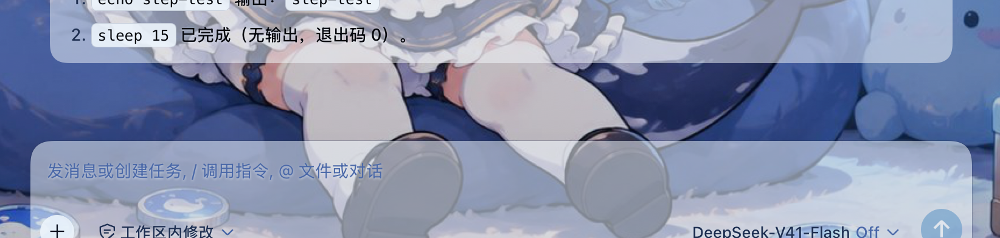

# dsh-delete-turn

**DeepSeek Harness 消息删除插件 —— 把一条消息从模型上下文里真正拿掉，同时从当前转录里隐藏它。** 助手回复挂在官方 `conversation.chat.assistant-actions` 槽位；用户消息、注入上下文、工具调用卡与过程行由 DOM 增强补上入口。确认后经官方 surface-replace 契约追加替换事件：模型后续看到的历史里不再有这条内容，而原始会话日志一个字节都不改写。

[中文](#中文) · [English](#english)

---

## 中文

<div align="center">
  
  <br>
  <sub>▲ 悬停消息行时出现的删除按钮（复制按钮右侧）</sub>
</div>

### 为什么需要它

DSH 的会话日志是 append-only 的：说错话、发错提示词、模型答偏了，这些内容会一直留在模型上下文里，污染后续每一轮。官方只提供了「压缩」（`/compact`）这种整段摘要机制，没有单条消息级别的删除。

这个插件把删除放回消息本身：

- 用户消息 → 删这一条；
- 思考卡 / 工具调用卡 → 删这一步（该步的 `assistant/message` 与它请求的 `tool/result` 一起走，工具配对永不悬空）；
- 助手回复（官方操作条）→ 删这条回复连同它的思考、工具调用与注入上下文（你的提问保留）；
- 注入上下文行、失败回合行 → 同样有删除入口。

### 特性

- **模型上下文级删除** —— 追加一条官方 `surfaceOp: { op: 'replace', startSeq, endSeq }` 替换事件，被遮蔽的内容不再进入 `deriveMessages()`；与宿主 `/compact` 同一套官方契约
- **转录级隐藏** —— 客户端按 `data-chat-flow-*` 锚点与官方 `useChat` 快照定位行，删除后折叠退场；刷新、重启 DSH、换标签页后依旧隐藏
- **日志即台账** —— 隐藏依据直接从日志里的替换事件重建（替换事件的消息 source 标记为本插件），不依赖 localStorage、不需要预检，也不会和其它插件（如压缩）的替换混淆
- **原生视觉** —— 复用官方 primitives 的 Modal / Button 与主题 token，明暗主题自动适配；图标与全部文案为原创
- **中英双语** —— 弹窗、提示、错误原因随系统语言即时切换
- **安全边界** —— 只接受回环地址且 Host 为本机的请求；目标必须是当前 surface 节点、不能碰系统提示词头、回合进行中拒绝、已被删除的目标拒绝并给出机器原因码

### 截图

<div align="center">
  
  <br>
  <sub>▲ 删除前确认：说明影响范围，原始日志不改写</sub>
  <br><br>
  
  <br>
  <sub>▲ 删除后：该行从转录中消失，后续内容自然上移</sub>
</div>

### 安装

```sh
# npm 安装（web profile）
dsh plugin --profile web add dsh-delete-turn

# 本地工作区（开发）
dsh plugin --profile web add link:/path/to/dsh-delete-turn
```

安装后需要**完全重启 DSH 进程**（宿主侧插件树只在启动时读取）。浏览器端 bundle 由宿主按请求动态 serve，重启后**硬刷新**页面即可生效。核实是否加载：

```sh
dsh --profile web --dump-config   # 应出现 "# == dsh-delete-turn" 段落
```

### 使用

1. 悬停任意消息行，点击行尾的垃圾桶按钮；助手回复的按钮在官方操作条（复制 / 分叉旁边）。
2. 确认弹窗会说明这次删除的影响范围，点「删除」。
3. 目标行折叠退场；模型上下文在**下一轮请求**重建时不再包含它。

### 工作原理

```
UI（官方槽按钮 / DOM 增强按钮）
  → 确认弹窗
  → POST /dsh-delete-turn/delete { sessionId, mode, seq? / messageId? / turn? }
宿主：
  sessionQuery.readSession() 读完整日志（live 优先）
  自实现 surface fold → 当前 surface 节点 + 历史替换遮蔽集
  校验（当前节点 / 区间干净 / 回合已闭合 / 不碰系统头）
  session.append('user/message', 空内容占位, {
    surfaceOp: { op: 'replace', startSeq, endSeq },
    sourceEventSeqs: [被遮蔽的全部 seq],
  })
  等待官方 session/flush 持久化检查点
  → 返回 { hidden: [{ seq, mode }] }
客户端：
  useChat 快照把 data-chat-flow-key 映射到节点，按 hidden 集合折叠行
  GET /dsh-delete-turn/state 在每次打开会话时重建 hidden 集合
```

设计要点：

- **为什么用空的 `user/message` 占位**：官方格式校验把 `system/message` 钉在「打开中的 step」上（不能用于回合外的删除），而 `assistant/message` 禁止携带 `sourceEventSeqs`（无法声明被遮蔽节点）。压缩检查点用的正是 `user/message` 替换；空内容占位不会给模型留下任何可读文本（实测后续请求正常）。
- **为什么不读 React fiber / CSS 哈希类名**：行定位只用官方 `data-chat-flow-*` 锚点与官方 `useChat` 标准 hook，宿主 UI 重构不会静默失效。
- **为什么刷新后仍然隐藏**：隐藏台账不是浏览器本地状态，而是日志里替换事件的可重放推导；宿主 `/state` 路由在每次打开会话时重建它。

### 已知限制

- append-only 语义下没有「反删除」：被遮蔽的内容无法真正恢复，删除不可撤销（原始日志仍在，可用官方工具自行重建会话）。
- 回合进行中不允许删除；请等回复结束后操作。
- 系统提示词头（surface 节点 0）不可删除。
- 助手操作条的删除范围是**整条回复**；要只删某一步，请用思考卡 / 工具卡上的按钮。
- 宿主侧插件树仅在 DSH 启动时加载：安装、更新插件后必须完全重启 DSH。

### 兼容性

- 实测 DSH `0.1.6-alpha.2`（web profile，Safari / WebKit 与 Chromium 内核均验证）。
- 宿主半区零运行时依赖，全部服务经 cordis ctx 解析；缺少 `sessionQuery` 时回退到 live 会话快照。
- 不修改 DSH 官方源码，不写任何私有事件类型。

### License

MIT

---

## English

<div align="center">
  
  <br>
  <sub>▲ The delete action appears when a message row is hovered</sub>
</div>

### Why

A DSH session log is append-only: a wrong prompt or a bad answer stays in the model context and pollutes every later turn. The only official tool is whole-range compaction (`/compact`); there is no per-message delete.

This plugin puts deletion back on the message itself:

- user message → remove that one message;
- reasoning card / tool card → remove that step (the step's `assistant/message` and the `tool/result` it requested leave together, so tool pairs never dangle);
- assistant reply (official action strip) → remove the whole reply attempt with its reasoning, tool calls and injected context (your prompt stays);
- injected-context rows and failed-turn rows get an entry too.

### Features

- **Context-level delete** — appends the official `surfaceOp: { op: 'replace', startSeq, endSeq }` intent; shadowed content no longer reaches `deriveMessages()`. Same contract as `/compact`.
- **Transcript-level hide** — rows are located through official `data-chat-flow-*` anchors and the official `useChat` snapshot, then collapse out. The hide survives a reload, a DSH restart and other tabs.
- **The log is the ledger** — hidden seqs are re-derived from the replacement events themselves (their message source is marked with this plugin), so there is no localStorage sidecar, no preflight, and no confusion with compaction replacements.
- **Native look** — official primitives (Modal / Button) and theme tokens; icon and all copy are original.
- **Bilingual** — zh/en dictionaries follow the active locale.
- **Safety boundary** — loopback-only routes; targets must be current surface nodes, the system-prompt head is protected, a running turn is refused, and already-deleted targets fail with a machine code.

### Screenshots

<div align="center">
  
  <br>
  <sub>▲ Confirmation states the exact scope; the log is never rewritten</sub>
  <br><br>
  
  <br>
  <sub>▲ After deletion the row is gone from the transcript</sub>
</div>

### Install

```sh
# npm (web profile)
dsh plugin --profile web add dsh-delete-turn

# local workspace (development)
dsh plugin --profile web add link:/path/to/dsh-delete-turn
```

Then **fully restart the DSH process** (the host plugin tree is read at startup only). The browser bundle is served dynamically, so a hard refresh after the restart is enough. Verify:

```sh
dsh --profile web --dump-config   # expect a "# == dsh-delete-turn" section
```

### Usage

1. Hover a message row and click the trash action at its end; the assistant action sits in the official action strip next to copy/branch.
2. The dialog states the exact scope; click Delete.
3. The row collapses away; the model context stops containing it when the next request is rebuilt.

### How it works

```
UI (official slot action / DOM-enhanced action)
  → confirmation dialog
  → POST /dsh-delete-turn/delete { sessionId, mode, seq? / messageId? / turn? }
Host:
  sessionQuery.readSession() reads the complete log (live-preferred)
  local surface fold → current surface nodes + historical shadowed seqs
  validate (current node / clean window / closed turn / protected head)
  session.append('user/message', empty placeholder, {
    surfaceOp: { op: 'replace', startSeq, endSeq },
    sourceEventSeqs: [every shadowed seq],
  })
  await the official session/flush durability checkpoint
  → { hidden: [{ seq, mode }] }
Browser:
  useChat snapshot maps data-chat-flow-key to nodes; hidden seqs collapse rows
  GET /dsh-delete-turn/state rebuilds the hidden set on every session open
```

Design notes:

- **Why an empty `user/message` placeholder**: the official format validation pins `system/message` to an open step (unusable for an out-of-band delete) and forbids `sourceEventSeqs` on `assistant/message` (so it cannot cite shadowed nodes). Compaction checkpoints use `user/message` replacements; an empty content array leaves no readable text for the model (verified with follow-up requests).
- **Why no React fiber or CSS-module hashing**: rows are addressed through official `data-chat-flow-*` anchors and the official `useChat` standard hook, so a host UI refactor cannot silently detach the actions.
- **Why a reload stays hidden**: the ledger is not browser state; it is a replay of the replacement events in the log, rebuilt by the host `/state` route.

### Known limitations

- Append-only semantics offer no un-delete: shadowed content cannot truly be restored, and deletion is irreversible (the original log survives; official tooling can rebuild a session from it).
- A running turn cannot be deleted; wait for it to settle.
- The system-prompt head (surface node 0) is protected.
- The assistant action strip deletes the whole reply attempt; use the reasoning/tool card to remove a single step.
- The host plugin tree loads at DSH startup only: fully restart DSH after installing or updating the plugin.

### Compatibility

- Verified against DSH `0.1.6-alpha.2` (web profile; WebKit and Chromium engines).
- The host half has zero runtime dependencies and resolves every service through the cordis context; it falls back to the live session snapshot when `sessionQuery` is absent.
- No DSH source is modified and no private event type is written.

### License

MIT
